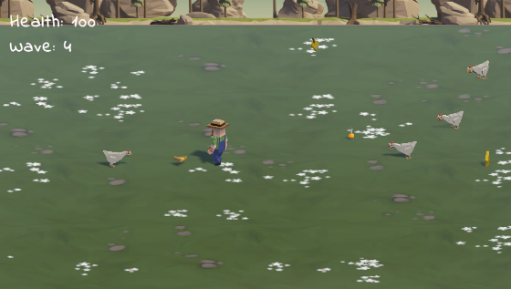

# Chicken? Run!

A micro Vampire Survivors style game where you play as a farmer who tries to not get eaten by very hangry chickens. This project was developed as a part of the Junior Unity Programmer course.

The point of this game is to survive for as long as possible while going through waves of hangry chickens. The farmer will throw the pizza slices automatically at the chickens, so the only thing that player needs to do is to avoid chickens touching them.

Every wave two things happen:
- A powerup spwans that the player can pickup to heal/amplify their abilities.
- Another chicken joins the wave. That means, that if you are on a wave 5, you will have to deal with 5 chickens.

The powerups that spawn are:
- Fire: Damage and damage rate increase.
- Potion: Heals the player.
- Lighting: Increase the player movement speed.
- Nuclear: All the above combined.

Controls - WASD/Arrow Keys to move the character. More specifically, AD/Left-Right Arrow Keys rotate the character, while WS/Forward-Backward Arrow Keys move the character in the chosen direction.

Happy surviving!

[Unity Play](https://play.unity.com/mg/other/webgl-builds-363164)
